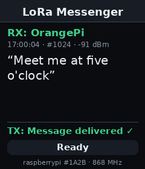

# LoRa Messenger

Speak into one radio and read it on the other. Hold the button and talk.
The Pi turns your speech into text **on the device**, shows it, and sends
it over LoRa. The other radio shows it with the sender's name and signal
strength, then sends back an ACK, and the first radio shows
**Message delivered ✓**. No internet, no gateway, no cloud ASR.

Hardware per radio: a Raspberry Pi or Orange Pi Zero 2W, a **Whisplay HAT**
(240×280 LCD, one button, RGB LED, microphone and speaker) and a
**Waveshare SX126X LoRa HAT** (E22-900T22S). This is a sibling of
[WalkieTalkie](../WalkieTalkie): it runs on the same hardware and reuses
WalkieTalkie's radio driver, Whisplay daemon client, button handling and
recorder, all proven on these HATs.



```
   hold          talk: recording → speech-to-text → LoRa
   1 click       step back through the message history
   2 clicks      resend the selected failed message, or back to live
   3 clicks      read the selected message aloud (needs espeak-ng)
   4 clicks      leave
```

---

## How it works

```
 Raspberry Pi                                   Orange Pi
 ─────────────                                  ─────────
 hold button → record (48 kHz, pre-roll)        SX126x → UART bytes
 → resample to 16 kHz                           → deframer: START, CRC-16
 → ASR (faster-whisper / vosk)                  → for me? duplicate?
 → show "TX → all: …" locally                   → ACK straight back
 → packet → SX126x ── LoRa 868 MHz ──────────►  → show "RX: RasPi" + text + dBm
 ← "Message delivered ✓"  ◄──────── ACK ──────
```

Transcription runs on its own thread, so the radio keeps receiving and
ACKing while Whisper works. The main loop never polls: it sleeps until a
button press, a packet or a finished transcription wakes it.

### Packet format

```
+-------+------+--------+--------+--------+--------+-----------+----------+
| START | TYPE |   ID   |  SRC   |  DST   | LENGTH |  MESSAGE  |  CRC-16  |
| 0xAA  |  1   | 2 (BE) | 2 (BE) | 2 (BE) |   1    |  0..200   |  2 (BE)  |
+-------+------+--------+--------+--------+--------+-----------+----------+
TYPE: 0x01 TEXT · 0x02 ACK · 0x03 HELLO · 0x04 HELLO_REPLY · 0x05 PING
```

This is the brief's START / TYPE / ID / LENGTH / MESSAGE with two
additions:

- **SRC/DST addresses.** An ACK has to find its way back to the sender,
  and the receiver needs to know who spoke to show "RX: OrangePi". The
  module could do the addressing itself, but only by reprovisioning,
  which needs the M0/M1 pins the LCD owns. So the addresses travel in
  the packet instead.
- **CRC-16/CCITT-FALSE** over everything after START. The SX1262 has its
  own CRC, but the UART between the Pi and the module has none, and a
  login console left on that port injects bytes the radio's CRC never
  sees.

Details are in [lora/packet.py](lora/packet.py). The deframer copes with
packets split across reads, with noise, and with the RSSI byte the module
appends after each packet. That byte can even be 0xAA (−86 dBm), the same
as START. WalkieTalkie frames on the same channel (`AA 55 …`) are ignored.

### Delivery: ACK, retry, duplicates

| Situation | What happens |
|---|---|
| ACK arrives | **Delivered ✓**, with the round-trip time |
| No ACK in `ack_timeout_seconds` (+ up to 0.5 s of random jitter) | sent again under the same ID, up to `max_retries` more times |
| Still no ACK | **Not confirmed ✗**. Not "not delivered": if only the ACKs were lost, the message did arrive, and the sender cannot tell. Two clicks resend it. |
| An ACK arrives after giving up | quietly marked delivered |
| The receiver gets a repeat | it ACKs again but shows the message only once (duplicates are remembered for 10 minutes by sender and ID) |
| A transcript is over 200 bytes | split at word boundaries into numbered parts ("part 1/2") |

Message IDs are saved across restarts, so a restarted radio never reuses
an ID the other side has just seen. Names are exchanged with
HELLO/HELLO_REPLY at start-up. If both of those are lost, the first TEXT
or ACK from an unknown radio triggers a HELLO to it. The EU 868 1% duty
cycle is enforced ([lora/airtime.py](lora/airtime.py)): a message and its
ACK take about 0.3 s of the 36 s allowed per hour.

### Speech recognition

All timings use the whisper.cpp JFK speech sample (a 3.3 s phrase and the
full 11 s). Both engines transcribed it word for word.

| Engine | Board | 3.3 s phrase | 11 s speech | Model load | Peak RAM |
|---|---|---|---|---|---|
| `faster-whisper` `tiny.en` (int8) | Pi 4 | 2.7–4.7 s | 4.9 s | 2–7 s | **315 MB** |
| `vosk` small-en-us-0.15 | Pi 4 | 2.5 s | 5.9 s | 2.8 s | 199 MB |
| `vosk` small-en-us-0.15 | **Pi Zero 2 W** | **5.8 s** | 12.5 s | 9 s | 152 MB |
| `whisper-cpp` | – | not measured | | | |

**Use Vosk on a 512 MB Pi Zero 2 W.** The board has about 140 MB free,
and Whisper's 315 MB would swap constantly. `./setup.sh` picks Vosk
itself on boards with less than 900 MB of RAM, and faster-whisper
otherwise.

Whisper always encodes a padded 30-second window, so a short phrase costs
almost as much as a long one. Vosk writes lower case, so the first letter
is capitalised for the screen. Before recognition, audio is high-passed
at 100 Hz: on the Zero 2 W's Whisplay microphone, 70% of the energy in a
quiet room was mains hum and rumble below 100 Hz, plus a DC offset.
Annotations such as `[BLANK_AUDIO]` are removed. `asr.engine: auto` uses
the first engine that is installed.

---

## Hardware facts that shape the build

These are inherited from WalkieTalkie; see its README for the full story.

1. **The radio is UART, not SPI.** The Waveshare SX126X HAT puts an EBYTE
   E22 module between the Pi and the SX1262. The module's firmware drives
   the chip over SPI internally, and the Pi only talks to it over serial
   (`/dev/ttyS0`, 9600 baud). So there are no BUSY, DIO1 or RESET lines
   to manage from Linux, only the serial port and the M0/M1 mode pins.
2. **M0/M1 share GPIO 22/27 with the LCD's backlight and DC lines.**
   Therefore:
   - The app keeps the backlight at 100%. Dimming is 1 kHz PWM on M0 and
     would deafen the radio.
   - The Whisplay driver must park DC (the radio's M1) low after each
     frame: [docs/whisplay-dc-fix.patch](docs/whisplay-dc-fix.patch),
     applied by `setup.sh`.
   - The screen is only redrawn when something changes. Each frame makes
     the radio deaf for about 11 ms.
   - Moving M0/M1 to free GPIOs and setting `radio.mode_pins` removes all
     three constraints.
3. **The module is provisioned once.** `provision_radio.py` writes the
   frequency and air rate to non-volatile memory. A module already
   provisioned for WalkieTalkie needs nothing more, because the settings
   are identical.
4. **One app per radio.** WalkieTalkie and the Messenger both use
   `/dev/ttyS0`. If both run, each steals the other's bytes. The app
   detects this and shows **LoRa port shared**. Quit one before starting
   the other.

---

## Install

From a development machine, copy the project over and run setup on the
device:

```bash
./deploy.sh jarvis@192.168.1.120 --setup      # picks the ASR engine by RAM
```

Or on the device itself: `./setup.sh` (`--check` only reports, `--yes`
accepts everything, `--asr` overrides the engine choice). It:

1. installs the apt packages (`python3-serial python3-yaml python3-pil
   python3-numpy python3-venv alsa-utils`, plus `espeak-ng`, which is
   optional and only used for reading aloud)
2. creates `.venv` and installs the ASR engine from wheels only, then
   fetches its model
3. checks the serial port for a kernel console and for other programs
   using it
4. checks the Whisplay runtime and the DC patch, and registers
   **Messenger** on the HAT desktop (`./install.sh`; `--autostart` to
   launch it at login)
5. runs the tests

A board that already runs WalkieTalkie has the UART, console and DC fixes
done. `setup.sh` reports on them rather than changing boot files. Its
installers (`../WalkieTalkie/setup.sh`) handle a fresh board.

Start it with `./run.sh` or from the HAT desktop.

### A Pi with a slow connection

A Zero 2 W with weak Wi-Fi can download at a few KB/s. At that rate,
fetching packages and models on the device takes hours. The Pi Zero 2 W
at 192.168.1.120 (signal −71 to −77 dBm, Wi-Fi power saving on) was
installed without the Pi downloading anything:

```bash
# on the development machine (same platform: aarch64, Python 3.13)
.venv/bin/pip wheel -w wheels vosk                  # vosk, srt, websockets, ...
curl -LO https://alphacephei.com/vosk/models/vosk-model-small-en-us-0.15.zip
# unzip it, then: tar -cf - vosk-model-small-en-us-0.15 | zstd -19 > model.tar.zst   (68 → 36 MB)
rsync -a --partial wheels/vosk-* wheels/srt-* wheels/websockets-* model.tar.zst jarvis@PI:.cache/messager-wheels/

# on the Pi
cd ~/Messager && mkdir -p models && zstd -dc ~/.cache/messager-wheels/model.tar.zst | tar -C models -xf -
python3 -m venv --system-site-packages .venv
.venv/bin/pip install --no-index --find-links ~/.cache/messager-wheels vosk
./setup.sh --asr vosk        # now finds everything in place
```

Send only what the Pi lacks. Its system packages already covered numpy,
cffi, requests and tqdm. `sudo iw wlan0 set power_save off` (until the
next reboot), or moving the Pi closer to the router, speeds up the link.

## Bring-up, stage by stage

| Stage | Command |
|---|---|
| Talk to the module | `python3 provision_radio.py --check` (daemon stopped) |
| Send a HELLO between the boards | `python3 tools/linktest.py listen` on one, `python3 tools/linktest.py hello` on the other |
| Test the ASR engine | `./run.sh --transcribe clip.wav` |
| Check the screen layout | `./run.sh --preview screen.png` |
| Range, packet loss and latency | `python3 tools/linktest.py ping -n 50` (the app or `linktest listen` on the far end) |
| Everything, no hardware | `python3 tools/sim_air.py`, then two `./run.sh --headless`; see below |

`linktest ping` reports loss, round-trip time and the ACK's signal
strength. Move one radio between runs and watch the numbers change.

### Two radios on one computer

[tools/sim_air.py](tools/sim_air.py) creates pseudo-terminals that behave
like E22 modules on one shared channel. Each strips the 3-byte address
header and appends an RSSI byte. `--loss 0.3` drops 30% of packets:

```bash
python3 tools/sim_air.py --loss 0.3          # prints e.g. /dev/pts/5 /dev/pts/6
MESSENGER_RADIO_PORT=/dev/pts/5 MESSENGER_IDENTITY_NAME=RasPi \
  MESSENGER_DATA_DIR=/tmp/a ./run.sh --headless
MESSENGER_RADIO_PORT=/dev/pts/6 MESSENGER_IDENTITY_NAME=OrangePi \
  MESSENGER_DATA_DIR=/tmp/b ./run.sh --headless
```

Type in either one. The apps will log `LoRa port shared`. That is the
simulator holding the other end of the pty, and it is expected here.

### Keyboard

When stdin is a terminal (or `input.keyboard: on`), typed lines are sent
as messages:

```
any text   send it           /talk      record; Enter stops and sends
/hello     announce us        /history   print recent messages
/retry     resend last failed /quit      leave
```

## Configuration

Everything is in [config.yaml](config.yaml), with defaults in
[config.py](config.py). Environment variables override the file, named
`MESSENGER_<SECTION>_<KEY>`, for example
`MESSENGER_ASR_ENGINE=vosk ./run.sh`.

| Setting | Default | Meaning |
|---|---|---|
| `radio.address` | `auto` | 0–65534. "auto" derives it from the hostname, so two boards with different hostnames need no setup |
| `radio.peer_address` | 65535 | who spoken messages go to. 65535 means everyone; the radio that hears it ACKs |
| `identity.name` | `auto` | shown on the other radio as "RX: name". "auto" uses the hostname |
| `messaging.ack_timeout_seconds` / `max_retries` | 3.0 / 3 | per attempt / resends after the first |
| `asr.engine` / `asr.model` | `auto` / `tiny.en` | see [Speech recognition](#speech-recognition) |
| `tts.enabled` | false | read received messages aloud |
| `audio.mic_level` | 80 | 100 overdrives the Whisplay preamp, and distorted audio transcribes badly |

Data lives in `~/.lora-messenger/`: `history.json` (the last 200
messages and the names learned from other radios), `ids.json` (the next
message ID) and the single-instance lock.

## Project layout

```
main.py              the app: state, gestures, keyboard, main loop, --transcribe/--preview
config.py            config.yaml + environment → dataclasses
asr/                 speech_to_text.py: engines, silence gate, clean-up
lora/                sx126x.py (E22 UART driver) · packet.py (format, CRC, deframer)
                     protocol.py (IDs, dedupe, splitting) · link.py (rx thread, tx + duty cycle)
                     airtime.py · modepins.py (is the radio deaf?)
audio/               recorder.py (pre-roll PTT) · player.py (cues, TTS) · dsp.py · devices.py
display/             board.py (Whisplay daemon client) · whisplay.py (layout, frames, backlight)
controls/            button.py (hold/click gestures) · keyboard.py
messaging/           sender.py (ACK/retry) · receiver.py · history.py
tools/               sim_air.py · linktest.py · launch_via_daemon.py
tests/               89 tests; fakes.py models the E22 module
```

---

## Update summary

- New project: voice → offline ASR → LoRa text messaging with ACK/retry,
  CRC-checked packets, message history and a Whisplay screen, built on
  WalkieTalkie's proven hardware layers.

## What changed

- New packet format with SRC/DST and CRC-16, and a stream deframer that
  handles the module's trailing RSSI byte, including when it equals START.
- ACK/retry with jitter, late-ACK recovery, duplicate suppression, IDs
  saved across restarts, and long transcripts split into parts.
- Pluggable ASR (faster-whisper, vosk, whisper.cpp) with a silence gate.
- `tools/sim_air.py` and `tools/linktest.py` for work without hardware
  and for range tests.
- Fixed during validation:
  - The Whisper model loaded twice under `--transcribe`.
  - The status briefly showed "Ready" between transcription and sending,
    costing an extra frame.
  - Text wrapping of very long words was 9× too slow.
  - Names were never learned when the start-up HELLOs were lost.
  - A failed send read "Not delivered" even when only the ACKs were lost.
    It now reads "Not confirmed".
- Fixed while deploying to the Pi Zero 2 W:
  - `setup.sh` was not executable, so `./deploy.sh --setup` could not
    have run it.
  - `setup.sh` now picks the ASR engine by RAM. It also treats
    `espeak-ng` as optional, so a board without sudo access can still
    report Ready.
  - Speech is high-passed at 100 Hz before recognition (hum and DC
    offset).
  - Vosk's lower-case transcripts are capitalised.
- Added `deploy.sh`.

## Validation

- `.venv/bin/python -m pytest tests -q`: **89 passed**, both here and on
  the Pi Zero 2 W (in 15 s). This includes the
  brief's final demonstration run through the real driver and app
  against fake E22 modules: "Meet me at five o'clock" goes from Pi to
  Orange Pi, and the Pi shows "Message delivered ✓".
- `./run.sh --transcribe jfk.wav` (the whisper.cpp speech sample) on a
  Pi 4: *"And so my fellow Americans ask not what your country can do for
  you ask what you can do for your country."* Load 2.0 s, transcription
  5.0 s for 11 s of audio.
- Two app processes over `tools/sim_air.py`:
  - No loss: delivered with ACK round trips of 43 and 56 ms, and the
    receiver showed "RX: RasPi" with RSSI.
  - 50% loss (15 packets dropped): 4 of 6 messages confirmed after up to
    4 tries. Repeats were ACKed but shown once. One message reached the
    far side although all of its ACKs were lost, which led to the
    "Not confirmed" wording.
- Installed on the **Pi Zero 2 W at 192.168.1.120** (Debian 13, Python
  3.13):
  - `./setup.sh --check` reports Ready.
  - The radio port opens and M0/M1 read transparent, with no other
    program on the port. Nothing was transmitted.
  - The Whisplay microphone records with the pre-roll, peaking at
    −15 dBFS with no clipping.
  - Vosk transcribes the sample word for word (timings in
    [Speech recognition](#speech-recognition)).
  - **Messenger** is registered on the HAT desktop.

## Notes

- **Not yet run end to end over the air.** Launching the app sends a
  HELLO. The next checks need a second radio: `linktest hello`, then
  `linktest ping`, then the app on both boards.
- **The silence gate does nothing on this microphone.** The Zero 2 W's
  filtered room noise measured 620–900 RMS against a threshold of 120,
  so only a dead microphone is caught. Vosk still returns nothing for
  noise, but takes about 11 s to decide, so an accidental press shows
  "Converting speech…" for that long. A gate based on dynamic range would
  fix this. It needs a few recordings of real speech through this
  microphone to calibrate without discarding quiet speech.
- **Speed on the Zero 2 W**: about 6 s from releasing the button to text
  for a short phrase. Feeding Vosk while recording, which it supports,
  would leave only the last moment of speech to process on release.
- Messages are not encrypted. Anyone on the frequency with this app can
  read them. WalkieTalkie's paired encryption could be carried over if
  that matters.
# Messenger
